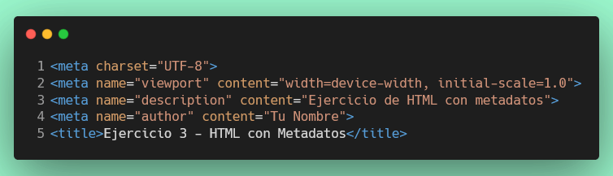

# Ejercicio 6: Crear un documento HTML con metadatos

## Configuración del Entorno de Desarrollo

### ¿Qué es un devcontainer?
Un devcontainer es un entorno de desarrollo en contenedor que garantiza que todos los estudiantes trabajen con las mismas herramientas y dependencias, independientemente de su sistema operativo local.

### Instalación de Docker

Antes de comenzar, necesitas tener Docker instalado en tu máquina:

#### Windows:
1. Descarga [Docker Desktop para Windows](https://www.docker.com/products/docker-desktop/)
2. Ejecuta el instalador y sigue las instrucciones
3. Reinicia tu computadora si es necesario
4. Verifica la instalación abriendo una terminal y ejecutando: `docker --version`

#### macOS:
1. Descarga [Docker Desktop para Mac](https://www.docker.com/products/docker-desktop/)
2. Abre el archivo .dmg descargado y arrastra Docker a la carpeta de Aplicaciones
3. Inicia Docker Desktop desde Aplicaciones
4. Verifica la instalación abriendo una terminal y ejecutando: `docker --version`

#### Linux:
1. Sigue las instrucciones para tu distribución en [docs.docker.com](https://docs.docker.com/engine/install/)
2. Configura Docker para ejecutarse sin sudo (opcional pero recomendado)
3. Verifica la instalación ejecutando: `docker --version`

### Abrir el proyecto en un devcontainer

1. Asegúrate de tener **VS Code** instalado
2. Instala la extensión **Dev Containers** en VS Code
3. Abre este proyecto en VS Code
4. Cuando VS Code detecte la configuración del devcontainer, verás una notificación:
   - Haz clic en **"Reopen in Container"** (Reabrir en Contenedor)
   - O presiona `F1`, escribe "Dev Containers: Reopen in Container" y selecciona esa opción
5. Espera a que el contenedor se construya (la primera vez puede tomar varios minutos)
6. Una vez listo, estarás trabajando dentro del devcontainer con todas las herramientas necesarias

### Verificación
Para verificar que estás trabajando dentro del devcontainer:
- En la esquina inferior izquierda de VS Code deberías ver un ícono verde con el texto "Dev Container: ..."
- Abre una terminal en VS Code (Terminal > Nueva Terminal) y ejecuta: `node --version`

## Visualización con Live Server

Para ver este ejercicio en tiempo real:

1. Asegúrate de tener la extensión **Live Server** instalada en VS Code
2. Abre el archivo `src/index.html` (página principal)
3. Haz clic derecho y selecciona "Open with Live Server"
4. Navega al enlace del Ejercicio 6 desde la página principal
5. Alternativamente, puedes abrir directamente `src/metadatos/index.html` con Live Server

## Objetivo
Crear un archivo HTML básico y agregar varias etiquetas de metadato en la sección `<head>`.

## Instrucciones

1. Crear la carpeta `src/metadatos`, si no existe, crea un archivo llamado `index.html` dentro de esta carpeta.
2. Dentro de `index.html`, escribe la estructura básica de un documento HTML.
3. Agrega al menos las siguientes etiquetas de metadato dentro de la sección `<head>`:



4. Agregar la meta etiqueta para definir soporte para el lenguaje español.
5. Agregar la meta etiqueta para definir el autor del documento como "Tu Nombre".
6. Agregar la meta etiqueta para definir la descripción del documento como "Este es un documento HTML de ejemplo con metadatos".
7. Agregar la meta etiqueta para definir las palabras clave del documento como "HTML, metadatos, ejemplo".
8. Agregar la meta etiqueta para definir la vista para dispositivos móviles con el contenido `width=device-width, initial-scale=1.0`.
9. Agregar la etiqueta `<title>` con el texto "Documento HTML con Metadatos".
10. Asegúrate de que el archivo HTML esté correctamente estructurado y que todas las etiquetas estén cerradas adecuadamente.

## Nota importante
Recuerda que debes crear también un archivo `index.html` en la carpeta `src` (raíz del proyecto fuente) que sirva como página principal y contenga enlaces a todos los ejercicios para facilitar su visualización con Live Server.

## Estructura final esperada

```
src/
├── index.html (página principal con enlaces a los ejercicios)
└── metadatos/
    └── index.html (ejercicio 6)
```

## Verificación
Una vez que hayas completado el ejercicio ejecuta:
``` npm
  npm test ejercicio/6
```
Si pasa todos los test, haz commit de tus cambios y súbelos a tu repositorio de GitHub.  

Una vez que hayas completado el ejercicio, haz commit de tus cambios y súbelos a tu repositorio de GitHub.

¡Buena suerte y diviértete programando!
