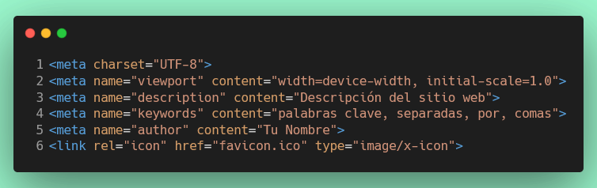

# Ejercicio 7: Crear un documento HTML con metadatos y favicon

## Configuración del Entorno de Desarrollo

### ¿Qué es un devcontainer?
Un devcontainer es un entorno de desarrollo en contenedor que garantiza que todos los estudiantes trabajen con las mismas herramientas y dependencias, independientemente de su sistema operativo local.

### Instalación de Docker

Antes de comenzar, necesitas tener Docker instalado en tu máquina:

#### Windows:
1. Descarga [Docker Desktop para Windows](https://www.docker.com/products/docker-desktop/)
2. Ejecuta el instalador y sigue las instrucciones
3. Reinicia tu computadora si es necesario
4. Verifica la instalación abriendo una terminal y ejecutando: `docker --version`

#### macOS:
1. Descarga [Docker Desktop para Mac](https://www.docker.com/products/docker-desktop/)
2. Abre el archivo .dmg descargado y arrastra Docker a la carpeta de Aplicaciones
3. Inicia Docker Desktop desde Aplicaciones
4. Verifica la instalación abriendo una terminal y ejecutando: `docker --version`

#### Linux:
1. Sigue las instrucciones para tu distribución en [docs.docker.com](https://docs.docker.com/engine/install/)
2. Configura Docker para ejecutarse sin sudo (opcional pero recomendado)
3. Verifica la instalación ejecutando: `docker --version`

### Abrir el proyecto en un devcontainer

1. Asegúrate de tener **VS Code** instalado
2. Instala la extensión **Dev Containers** en VS Code
3. Abre este proyecto en VS Code
4. Cuando VS Code detecte la configuración del devcontainer, verás una notificación:
   - Haz clic en **"Reopen in Container"** (Reabrir en Contenedor)
   - O presiona `F1`, escribe "Dev Containers: Reopen in Container" y selecciona esa opción
5. Espera a que el contenedor se construya (la primera vez puede tomar varios minutos)
6. Una vez listo, estarás trabajando dentro del devcontainer con todas las herramientas necesarias

### Verificación
Para verificar que estás trabajando dentro del devcontainer:
- En la esquina inferior izquierda de VS Code deberías ver un ícono verde con el texto "Dev Container: ..."
- Abre una terminal en VS Code (Terminal > Nueva Terminal) y ejecuta: `node --version`

## Visualización con Live Server

Para ver este ejercicio en tiempo real:

1. Asegúrate de tener la extensión **Live Server** instalada en VS Code
2. Abre el archivo `src/index.html` (página principal)
3. Haz clic derecho y selecciona "Open with Live Server"
4. Navega al enlace del Ejercicio 7 desde la página principal
5. Alternativamente, puedes abrir directamente `src/metadatos/servicios.html` con Live Server

## Objetivos
Crear un archivo HTML básico y agregar varias etiquetas de metadato en la sección `<head>`. Agregar un favicon al documento HTML.

## Requisitos

1. Debe existir una carpeta `src/metadatos`, del ejercicio anterior, y un archivo llamado `index.html` dentro de esta carpeta.
2. El archivo `index.html`, debe tener la estructura básica de un documento HTML.
3. Con las etiquetas de metadato dentro de la sección `<head>`:



4. Asegúrate de que el archivo HTML esté correctamente estructurado y que todas las etiquetas estén cerradas adecuadamente.
5. Debes incluir un favicon en el documento HTML. El favicon debe ser un archivo llamado `favicon.ico` y debe estar en la misma carpeta que el archivo `index.html`.

## Instrucciones
1. Crea el archivo `servicios.html` dentro de la carpeta `src/metadatos`
2. Abre el archivo `servicios.html` en tu editor de código. 
3. Agrega la estructura básica de un documento HTML.
4. Dentro de la sección `<head>`, agrega las siguientes etiquetas de metadato:
5. Asegúrate de que el favicon `favicon.ico` esté en la misma carpeta que el archivo `servicios.html`.
6. Actualiza el archivo `src/index.html` (página principal) para que incluya un enlace a este ejercicio si aún no lo tiene.

*Si no tienes un favicon, puedes crear uno simple o descargar uno de internet.*

## Estructura final esperada

```
src/
├── index.html (página principal con enlaces a los ejercicios)
└── metadatos/
    ├── index.html (ejercicio 6)
    ├── favicon.ico
    └── servicios.html (ejercicio 7)
```

## Verificación

Para verificar que tu archivo `servicios.html` cumple con los requisitos, debes asegurarte de que:

   1. Estructura HTML básica completa
   2. Título con contenido significativo
   3. Metaetiqueta charset UTF-8
   4. Metaetiqueta viewport con configuración responsive
   5. Metaetiqueta description con contenido válido
   6. Metaetiqueta keywords con comas separando las palabras
   7. Metaetiqueta author con nombre válido
   8. Enlace al favicon con los atributos correctos

## Validaciones de calidad:

   1. Todas las metaetiquetas deben estar en el <head>
   2. No debe haber metaetiquetas duplicadas
   3. El contenido de las metaetiquetas debe ser válido y significativo
   4. El documento debe estar bien formado

## Compatibilidad con ejercicio anterior:

   1. Verifica que el index.html del ejercicio 6 sigue funcionando.
   2.  Mantiene los metadatos del ejercicio anterior.
``` npm
  npm test ejercicio/6
```

Una vez que hayas completado el ejercicio ejecuta:
``` npm
  npm test ejercicio/7
```
Si pasa todos los test, haz commit de tus cambios y súbelos a tu repositorio de GitHub.  

Una vez que hayas completado el ejercicio, haz commit de tus cambios y súbelos a tu repositorio de GitHub.

¡Buena suerte y diviértete programando!
